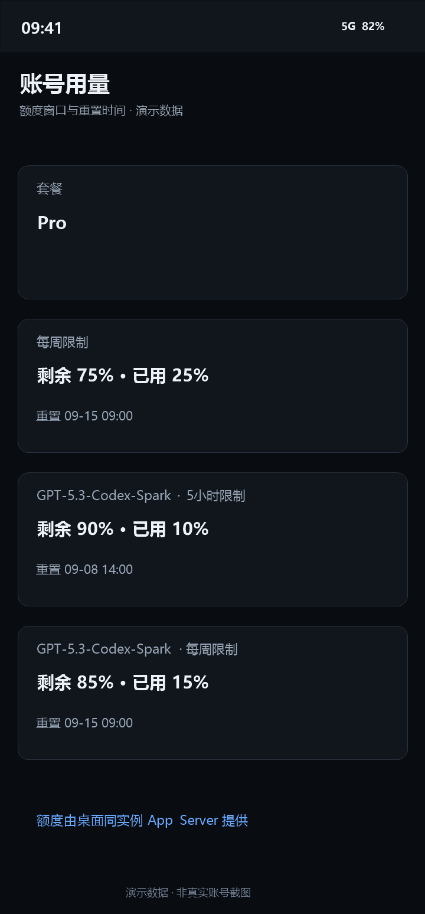
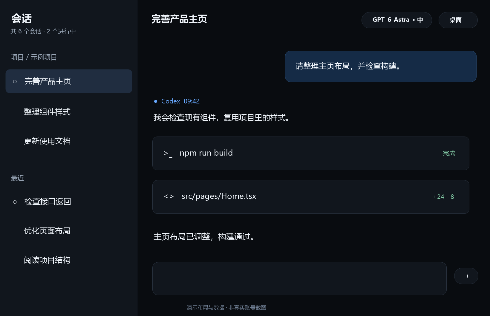

# Codex Harmony Remote

**在鸿蒙手机、折叠屏和平板上，继续电脑里的 Codex 任务。**

查看会话、发送消息、跟进工具执行、处理确认请求，在离开电脑后继续工作。桌面仍负责运行 Codex，手机提供适合触屏的任务界面。

[快速开始](#快速开始) · [部署文档](docs/agent/BOOTSTRAP.md) · [配置说明](docs/agent/CONFIGURATION.md) · [排查问题](docs/agent/TROUBLESHOOTING.md)

## 界面预览

以下为基于应用界面绘制的**演示图，并非真实账号截图**。项目、消息、路径、时间和额度均为示例数据；不包含用户会话或部署信息。具体布局会随设备尺寸和主题调整。

| 会话与项目 | 对话与工具记录 | 账号额度 |
| :---: | :---: | :---: |
|  |  |  |

### 平板与折叠屏

宽屏双栏同时展示会话列表和当前对话，减少任务切换。



## 可以做什么

- **继续桌面任务**：浏览项目和会话，向已有任务发送消息，选择模型与思考强度。
- **查看执行过程**：阅读 Markdown、代码、工具调用与文件变更，按需加载更早的历史。
- **在手机上操作**：发送图片与附件，处理审批和补充输入，中断正在执行的任务。
- **查看账号额度**：从桌面同实例 App Server 读取用量窗口、剩余比例和重置时间。
- **适配移动设备**：支持手机、宽屏双栏、主题与字号调整，以及桌面监控视图。
- **连接自己的电脑**：提供局域网直连和可选的公网中转部署脚本。

## 本次更新

本次源码同步包含本地 1.0.14 系列的手机／平板能力及以下修复：

- 任务列表使用桌面同实例 `thread/list`，避免将自行扫描到的内部任务混入手机列表。
- 额度读取改为官方 `account/rateLimits/read`，移除旧 HTTP 请求和页面文字抓取逻辑。
- 修复历史刷新时旧消息追加到最新消息之后，导致底部看似丢失新消息的问题。
- 同一消息更新时替换内容，保留不同消息 ID 的独立记录。
- 修复桌面 CDP 页面识别，避免误连嵌入的网页。

**当前边界**：任务列表与额度已复用桌面官方接口；历史详情仍读取本地会话记录。官方历史分页在实测中出现缺轮，因此尚未切换，不能将当前版本理解为全链路单一事实源。CDP 接入仍依赖桌面版本，升级桌面后应重新验证连接。

本次代码验证为 **440 项测试通过**。手机安装及历史自动刷新已做实机检查；这不代表所有设备、网络和桌面版本组合均已验证。

## 快速开始

### 准备环境

| 环境 | 要求 |
| --- | --- |
| 电脑 | Windows，PowerShell 5.1 或更新版本 |
| Node.js | **24 或更新版本**，包含项目所用的 SQLite 与测试能力 |
| 桌面端 | 已安装并登录 Codex Desktop，按部署文档启用桌面连接 |
| 构建工具 | DevEco Studio、HarmonyOS SDK、HDC 与本机签名配置 |
| 移动设备 | 支持本项目 SDK 的鸿蒙设备，开启开发者模式及调试授权 |

源码仓库不提供用户签名文件。HAP 需要在本机完成配置、签名后安装。

### 安装与部署

```powershell
git clone https://github.com/CCDawn/codex-harmony-remote.git
cd codex-harmony-remote
npm install
powershell -ExecutionPolicy Bypass -File .\scripts\agent\setup.ps1
```

根据 [配置说明](docs/agent/CONFIGURATION.md) 填写生成的本地配置，然后检查环境并启动局域网模式：

```powershell
powershell -ExecutionPolicy Bypass -File .\scripts\agent\doctor.ps1 -Json
powershell -ExecutionPolicy Bypass -File .\scripts\agent\start-stack.ps1 -SkipHdcRelay
powershell -ExecutionPolicy Bypass -File .\scripts\agent\deploy-app.ps1 -Build
```

详细步骤见 [BOOTSTRAP](docs/agent/BOOTSTRAP.md)。也可以让本机编码助手先读取 [AGENTS.md](AGENTS.md)，按项目脚本完成配置和诊断。

### 公网中转

在需要离开局域网访问时，按 [配置说明](docs/agent/CONFIGURATION.md) 设置中转服务器、本机代理和手机连接参数，再运行启动及部署脚本。中转服务器不运行第二个 Codex 实例。

```text
鸿蒙设备 → 局域网 / 可选中转 → Windows 本地桥接 → Codex Desktop
                                           └→ 本地历史记录（当前实现）
```

桥接能够控制桌面并读取会话。公网部署必须配置独立的强令牌和防火墙规则，不要直接公开未认证的桥接或 HDC 端口。

## 项目结构

| 目录 | 内容 |
| --- | --- |
| `HarmonyCodexRemote/` | 鸿蒙主应用：会话、图片、工具记录与移动布局 |
| `HarmonyHdcRelayHelper/` | 可选的手机 HDC 中转助手 |
| `src/` | Node 桥接、桌面适配、会话与额度接口 |
| `scripts/agent/` | 配置、诊断、启动、部署和公开发布检查 |
| `tools/harmony/` | 鸿蒙构建、签名、设备与链路工具 |
| `docs/agent/` | 部署手册、架构与故障排查 |

## 验证与贡献

```powershell
npm test
npm run agent:verify-release
```

发布检查会生成独立源码目录，扫描隐私信息、检查禁止发布的文件类型，并在该目录运行测试。

演示图可在 Windows 上重新生成：

```powershell
powershell -ExecutionPolicy Bypass -File .\scripts\agent\generate-readme-screenshots.ps1
```

请勿提交令牌、服务器地址、设备 ID、签名材料、构建包、运行日志、真实会话截图或提取的桌面程序。公开图片只使用明确标注的演示数据。

## 许可证

[MIT](LICENSE)。第三方依赖说明见 [THIRD_PARTY_NOTICES](docs/THIRD_PARTY_NOTICES.md)。
