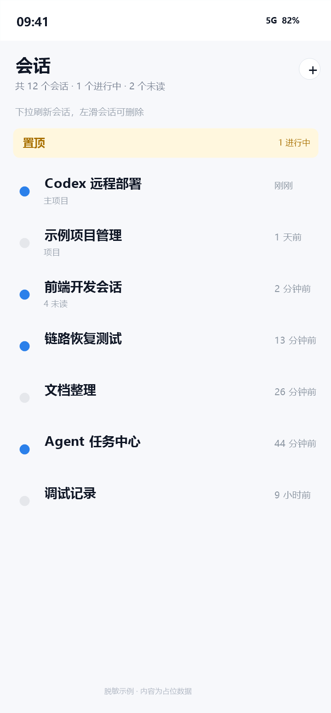
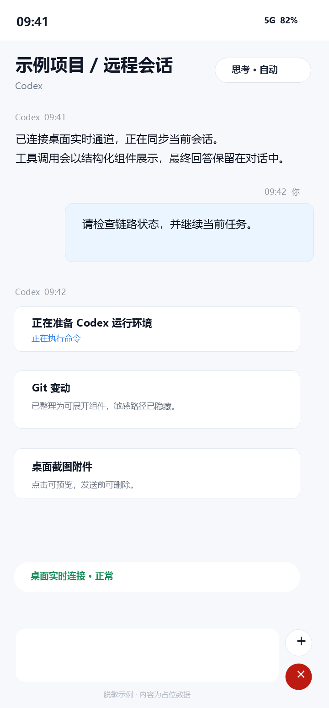
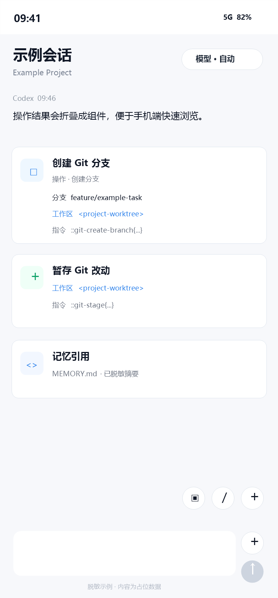

# Codex Harmony Remote

HarmonyOS remote client for operating Codex Desktop from a phone.

This repository is designed for agent-first deployment. A user's coding agent should be able to read `AGENTS.md`, run the agent scripts, diagnose the local environment, build the HarmonyOS apps, and recover the remote link without reverse-engineering this machine's historical setup.

## Agent Quick Start

For a fresh machine, ask the local agent to start here:

```powershell
npm install
powershell -ExecutionPolicy Bypass -File .\scripts\agent\setup.ps1
powershell -ExecutionPolicy Bypass -File .\scripts\agent\doctor.ps1 -Json
powershell -ExecutionPolicy Bypass -File .\scripts\agent\start-stack.ps1
powershell -ExecutionPolicy Bypass -File .\scripts\agent\deploy-app.ps1 -Build
```

The detailed agent runbook is in `docs/agent/BOOTSTRAP.md`.

## Phone App Preview

The screenshots below are desensitized examples. They preserve the mobile UI structure while replacing conversation titles, project names, paths, messages, and timestamps with placeholder content.

<p>
  
  
  
</p>

## What This Project Contains

- `src/`: local Node bridge, Codex session APIs, desktop live/CDP integration, link health and recovery APIs.
- `HarmonyCodexRemote/`: HarmonyOS main app for conversations, screenshots, images, model settings, interrupts, and link recovery.
- `HarmonyHdcRelayHelper/`: HarmonyOS helper app for wireless HDC relay support.
- `scripts/`: local startup, desktop live injection, diagnostics, remote access, and relay helpers.
- `scripts/agent/`: stable entrypoints intended for other agents.
- `tools/harmony/`: HarmonyOS deployment, HDC relay, and device diagnostic scripts.
- `docs/agent/`: deployment and troubleshooting documents written for agents.

## Required Local Tools

- Windows PowerShell 5.1 or newer.
- Node.js 20 or newer.
- HarmonyOS / OpenHarmony command-line tools, including `hdc.exe`.
- DevEco Studio or a compatible HarmonyOS build toolchain.
- Codex Desktop installed locally.
- A HarmonyOS device with developer mode enabled.

## Security Notes

Do not expose the bridge or HDC relay publicly without a strong token and firewall rules. The bridge can operate Codex Desktop and read local session metadata.

Never commit:

- Bridge tokens or relay tokens.
- Real public IPs or private server addresses.
- Device IDs.
- Harmony signing files.
- Built HAP packages.
- Logs, screenshots, and mobile-uploaded images.
- Extracted Codex Desktop bundles or third-party source snapshots under `tmp/`.

Run the full open-source release gate before publishing:

```powershell
npm run agent:verify-release
```

This creates a clean publish directory, scans the staged repository, checks forbidden file classes, and runs the tests in the staged copy.

Manual staging is also available:

```powershell
powershell -ExecutionPolicy Bypass -File .\scripts\agent\create-open-source-staging.ps1 -ForceClean
```

## Deployment Modes

Local/LAN mode:

```powershell
powershell -ExecutionPolicy Bypass -File .\scripts\agent\start-stack.ps1 -SkipHdcRelay
powershell -ExecutionPolicy Bypass -File .\scripts\agent\deploy-app.ps1 -Build
```

Public relay mode:

1. Configure `tools\harmony\hdc-relay.local.psd1` from the example.
2. Start the relay server on the public host.
3. Start the local stack on the Windows host.
4. Deploy the main app and helper app to the phone.
5. Run `scripts\agent\doctor.ps1 -Json` and verify all required checks are `ok`.

## License

The repository is being prepared for open source release. Choose and add a final license before making the GitHub repository public.
